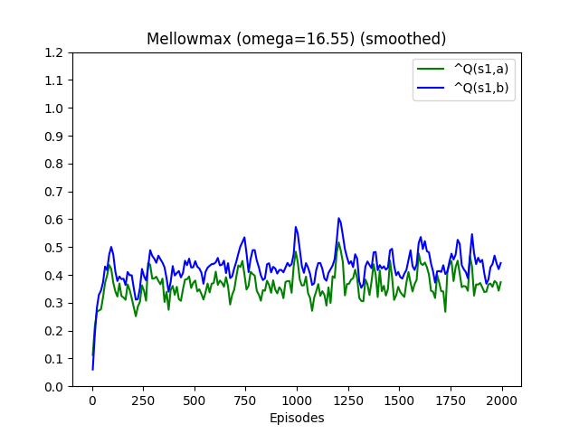
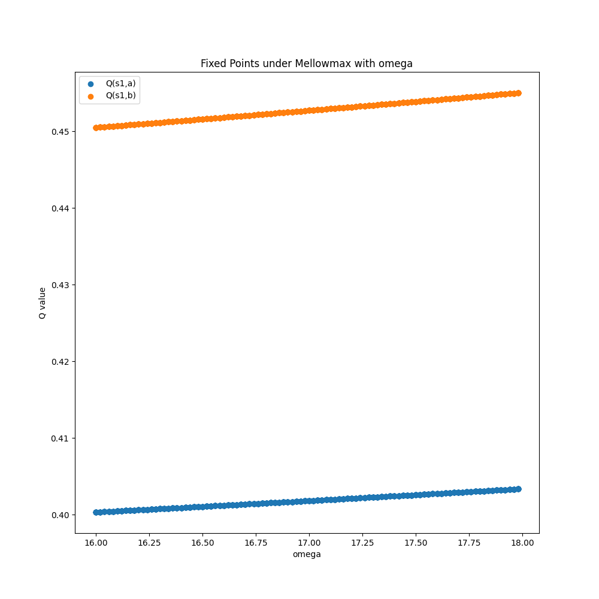

# Replication Project

## Part 1 - Sample MDP

### SARSA

Applying SARSA with Boltzmann Softmax to the problem described in paper's figure 1 could lead to non-single convergent
points. Run the following codes to replicate it:

```shell
python3 code/sample_mdp_sarsa.py
```
<table>
<tr>
        <td></th>
        <td></td>
    </tr>
</table>

### Generalized Value Iteration (GVI)

In the convergence theorem of GVI, the operator with non-expansion property is proved convergent. Boltzmann Softmax

```shell
python3 code/sample_mdp_gvi.py
```

<table>
<tr>
  <th>Update Vectors</th>
  <td></th>
  <td></th>
</tr>
<tr>
  <th>Fixed Points</th>
  <td></td>
  <td></td>
</tr>
</table>
